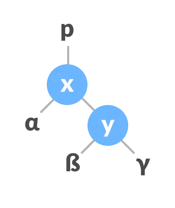

# Tree Definitions

- **root node:** there is a single node in a tree with no parents, called the
root.
- **parent node:** any node in a tree with children (linked nodes such that
there is no path through the child to the root).
- **child node:** node linked to a parent node, such that the path from the
child to the root must go through the parent node.
- **binary tree:** a tree with at most two children at each node

Properties of nodes:

- **height:** the number of edges from the node to the farthest reachable leaf
node.
  - The **height of a tree** is the height of its root node.
  - leaf nodes have height zero.
  - empty tree has height -1.
- **depth:** the number of edges from the node to the root.
  - The root node has depth zero.

Properties of binary trees:
- **balance:** a balanced binary tree has the property that the left and right
subtrees differ in height by no more than one.
- **full binary tree:** every node has either 0 or 2 children. Recursive
definition: a tree that is either a single vertex (the root node),
or a root node with two subtrees, both of which are full binary trees.
- **complete binary tree:** a tree in which every level, except possibly the
last, is completely filled. The nodes in the last level are all as far left as
possible, with no gaps.

# Binary tree traversal

- **pre-order**:
  1. process current node
  2. recursively traverse Left subtree
  3. recursively traverse Right subtree
  - Pre-order returns nodes in *topologically sorted* order: for every directed
  edge from *u* to *v*, we will return *u* before *v*
  - Another way of saying, pre-order traversals always visit *roots* before
  *leaves*
  - Also will return nodes in order needed to make a copy of tree!
- **in-order**:
  1. recursively traverse Left subtree
  2. process current node
  3. recursively traverse Right subtree
  - gives nodes in order for a binary search tree (will discuss next week)
- **post-order**:
    1. recursively traverse Left subtree
    2. recursively traverse Right subtree
    3. process current node
    - Useful for binary *expression* trees: can handle binary and unary operators
    - Example: A + B * C
    - "Reverse Polish Notation" and history of calculators
    - Explore *leaves* before *nodes*
      - Example: tree is computing partial cumulative sums of leaves, or average scores of different populations

# Binary Search Trees

Definition: the value of each left child is less than or equal to the value of its parent.
The value of each right child is greater than the value of its parent.

## Insertion

(examples on board)

## Worst case scenario

root is largest or smallest element, and elements are added in sorted order.
Binary search tree degenerates into a linked list.

## Rebalancing?

1. Do an in-order traversal, store elements in order in a linked list
2. Find the median of this list, set as root node, recurse for left child with
left half of list, and right half of list for right child.

## Deletion

What are the cases?

1. No children: just delete
2. Node with one child: link child to parent
3. Node with two children:
- identify right child
- replace value of node with value of right child
- delete right child (recurse)

Could also do with left child. Check that both ways maintain the BST property.

# Heaps

Special case of complete binary trees: all levels full except last, last level all nodes are far left

Properties:

- complete
- binary
- max-heap: all children are less than their parents
- min-heap: all children are greater than their parents

## Adding elements

1. Add new element to bottom of tree, in the first available place to maintain completeness
2. Restore heap ordering: new element is shifted up tree to proper place
   - Swap element with parent if out of order
   - Continue until parent has proper ordering

This process is called "percolating" / "bubbling" / "sifting" / "heapify-ing"

## Removing elements

1. Remove node, replace with rightmost leaf in the last level of the heap (to maintain completeness)
   - but this breaks our ordering property!
2. (For min heap) swap value with smallest child
   - (For max heap) swap value with largest

## Array representation

Since we know we have a complete tree, with careful indexing we can implement a heap in an array

Process:

```
Let index of root = 1
For any node n at index i:
    index of n.left = 2i
    index of n.right = 2i+1
    Parent index of n?
        floor of i/2
If array runs out of space, we can copy data into larger array
```

## Heap Sort

Basic idea: add each element to heap, then remove top element N times

In-place solution: maintain max-heap in array, build sorted array from back to front of array

Algorithm performance?

- O(n lg n)
- Unstable, in-place
- Good bound on worst-case scenarios, makes it well suited for real-time aapplications
- Not easily parallelizable

# AVL Trees

AVL trees are self-balancing binary search trees. They maintain the invariant
that the left child of a node is less than or equal to the parent, and the right
child is greater than or equal to the parent.

## Balance Factor

The balance factor of a node is B = (height of left subtree) - (height of right
subtree). The height of an empty tree is -1. The height of a single node is 0.

AVL trees maintain that $abs(B) \leq 1$, so B can be from the set $\{-1, 0,
1\}$. They do this through fancier add and remove methods.

## Insert

Inserting a value into an AVL tree begins just like a normal BST: starting at
the root, you search for the location that the node would be added.

Then, you recalculate all the balance factors, and rotate the tree if needed.

## Delete

Three cases:

1. removing leaf node: just remove leaf node
2. removing node with one child: remove node, replace with child.
3. removing node with two children:
   a. Find in-order successor `w` of the node to be deleted (node with minimum
value in the right subtree)
   b. replace the node to be deleted with `w`.
   c. remove leaf node `w`.
   d. update balance factors, rebalance if needed.

## Rotations and Rebalancing

### Left rotate




