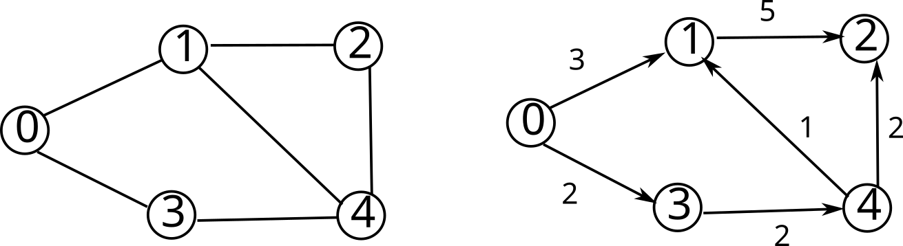

# Graphs

## Vocabulary

Like trees, graphs are formed from *nodes* connected by *edges*.

However, unlike trees, there is no special root node and cycles are allowed.

Sometimes nodes are called *vertices* (plural of *vertex*).

Edges within graphs may be *directed* or *undirected.* Edges may have *weights* associated
with them.

In the figure below, the graph on the left is undirected and unweighted. The
graph on the right is directed and weighted.



**Adjacency List:** One way to represent a graph. Each vertex is associated with
a list of its neighbors.

For example, we could use a hash map, and encode node labels as keys and lists
of neighbors as values. In that case, the graph on the left in the figure would
be represented as


and the directed graph on the right would be

```
0:[1,3]
1:[2]
2:[]
3:[4]
4:[1,2]
```

**Adjacency Matrix:** Another way to represent a graph, this time as a full
matrix. The entry at element $(i,j)$ indicates the presence, absence, or weight
of an edge from node $i$ to node $j$. The undirected unweighted graph could be
written as the following matrix, where 1 indicates the presence of an edge and 0
indicates no edge.

$$
\begin{bmatrix}
0 & 1 & 0 & 1 & 0 \\
1 & 0 & 1 & 0 & 1 \\
0 & 1 & 0 & 0 & 1 \\
1 & 0 & 0 & 0 & 1 \\
0 & 1 & 1 & 1 & 0 \\
\end{bmatrix}
$$

An undirected graph will always produce a symmetric matrix. We may also use
$\infinity$ to represent that node edge is present, usually in weighted graphs
where it may be possible to have an edge with weight zero. In weighted graphs,
the value at element $(i,j)$ of the matrix is the weight of the edge. Using this
convention, the representation of the directed weighted graph would be

$$
\begin{bmatrix}
0 & 3 & \infty & 2 & \infty \\
1 & 0 & 1 & 0 & 1 \\
0 & 1 & 0 & 0 & 1 \\
1 & 0 & 0 & 0 & 1 \\
0 & 1 & 1 & 1 & 0 \\
\end{bmatrix}
$$

## Graph Search

### Search Problem

Inputs:

  - start node
  - goal node

Output:

  - `null` if node does not exist in this graph
  - Or, entire path from start to goal (sequence of nodes)
  - Can also store "prev" data in field of node and reconstruct paths

### Breadth-First Traverse

Intuition: Explore graph by propagating a "wave" out from start node, in all directions

Algorithm:

1. from start node, look at all neighbors, mark start node visited
2. look at all neighbors-of-neighbors that have not been visited yet, mark neighbors visited
3. ...
4. profit!

Specifically, we use a queue to keep track of which node to visit next. When examining neighbors, we add them to the queue in whatever order we discover them (usually an array of neighbors specified in each node).

More complete traversal algorithm (procedural):

```java
public void BFS(Node s, T goal_data) {
  // create data structures and initialize start node
  HashMap<Node, boolean> visited = new HashMap<Node, boolean>();
  Queue<Node> frontier = new LinkedList<>();
  visited.put(s, "True");
  frontier.add(s);

  while (! frontier.isEmpty()) {
     Node curr = frontier.poll();
     if (curr.data == goal_data) return curr;

     for (Node n : curr.neighbors) {
        if (!visited[n]) {
            visited.put(n, "True");
            frontier.add(n);
        }
     }
     return null;
}
```

- Note that this traversal strategy gives nodes in *topological order* when applied to a tree, starting at the root node, or directed graphs in general.

### Depth First Search

- Intuition: explore as far as possible along each branch before backtracking

Recursive psuedocode:

```java
DFS(G, n):
   label n as visited
   for all neighbors w of v:
      if w not visited:
         DFS(G, w)
```

This implicitly uses the call stack as a stack to perform backtracking!
So we can also implement procedurally with an actual stack (psuedocode):

```java
DFS(G, n):
  let S be a stack
  S.push(n)
  label n as visited
  while S is not empty:
     v = S.pop()
     label v as visited
     for all neighbors w of v:
        if w not visited:
           S.push(w)
```

- Note that depending on when we print labels, we can get a pre-order (nodes in
  order they were first visited) or post-order (order they were last visited)


## Shortest Paths: Dijkstra's Algorithm

Beyond search (verifying if a path exists), we sometimes want to find the shortest path from A to B in a graph. In this case, we will consider weighted graphs.

- Assumption: no negative edge weights
  - Example of when we might want negatie weights: energy-aware travel graph with regenerative braking

### Initialization

- Create a set of all *unvisited* nodes. Call this set $U$.
- Assign a *distance* $dist$ to each node in the graph.
  - Assign $dist=0$ for the start node.
  - Assign $dist=\infty$ for all other nodes.
- set the start node to the **current node**, $c$, and remove it from $U$.

### Iteration

While $U$ is not empty:

- for (n : neighbors(current node))
  - let e(c, n) be the edge weight between c and n
  - update $dist(n)$: set to $min (dist(n), dist(c) + e(c,n))$
     - case where $dist(n)$ is smaller: path to $n$ through $c$ is not the shortest
     - case where $dist(c) + e(c,n)$ is smaller: shortest path to n found so far
- after processing all neighbors, mark $c$ as visited (remove from $U$)
- set current node $c$ to node in $U$ with minimum $dist$

### Run time?

- opportunity for optimization: min-heap, sorted on $dist$
- have to update min-heap every time we update $dist$
- multiple solutions, most performant (runtime) to add multiple copies of nodes to $U$ and maintain separate set of unvisited nodes

### Extracting path

- build shortest-path "tree" while computing
  - will not be tree if there are multiple same-cost shortest paths to a node
- can explicitly build tree:
  - add $c$ to tree when we remove from $U$
  - connect to neighbors already in tree such that $d(n) + e(c,n) = d(c)$
- can also make a pointer array $prev$
  - update $prev(n) = c$ every time we update $d(n)$
